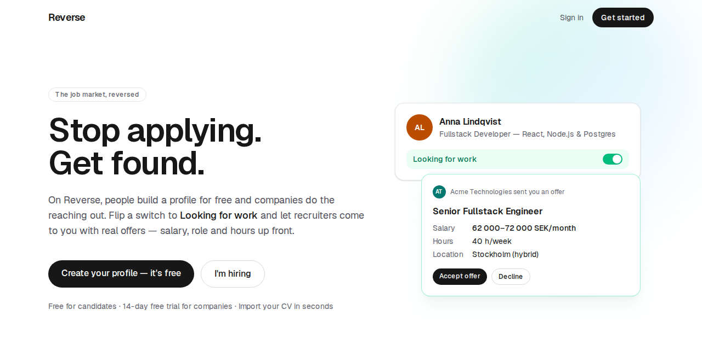
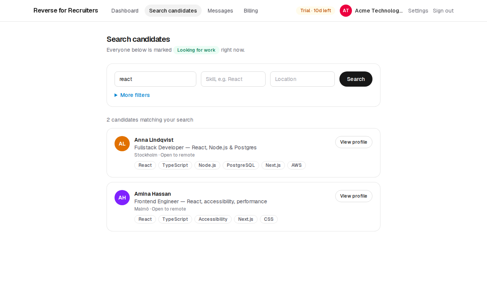
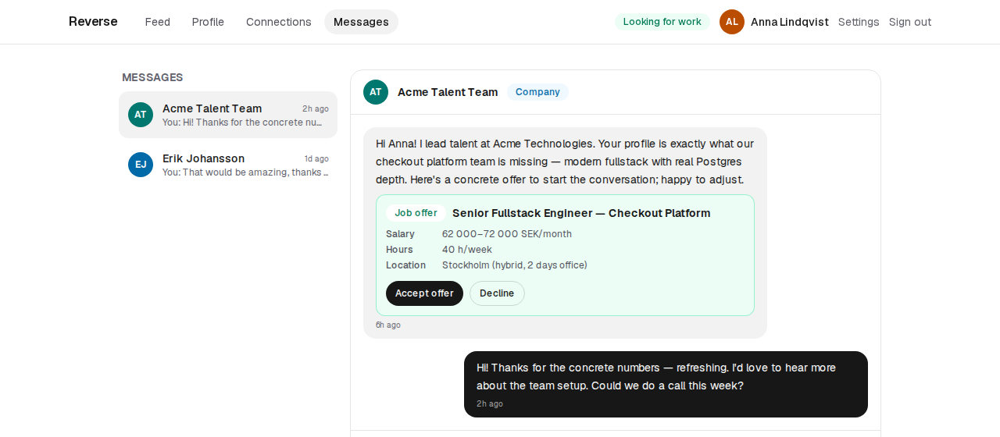
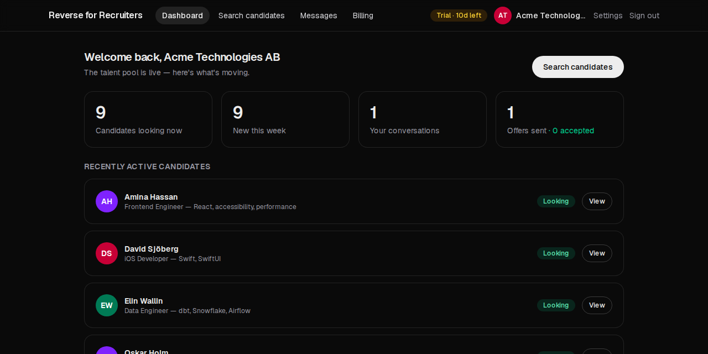
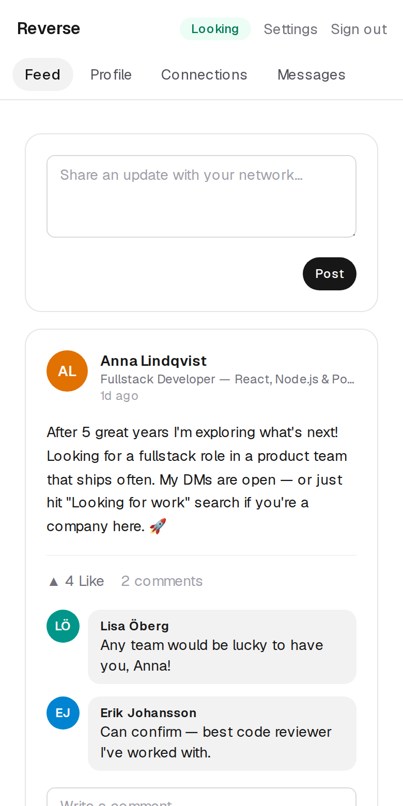
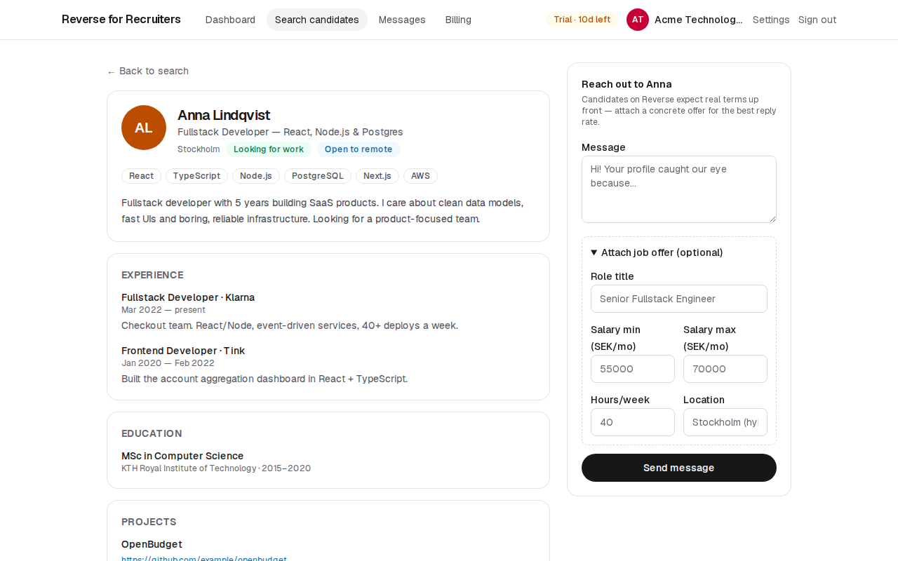

# Reverse — the talent marketplace where companies apply to you

Reverse flips the logic of LinkedIn and traditional job ads: **individuals build a
profile for free and companies pay to reach them**. Flip your status to
*Looking for work* and recruiters come to you — with salary, role and hours up
front.



| Company search | Structured offer (candidate view) |
| --- | --- |
|  |  |
| **Company dashboard (dark mode)** | **Phone** |
|  |  |



## Features

**For candidates (free)**
- Rich profile: experience, education, projects, skills, certifications
- **CV import**: upload a PDF → text extracted on our server → structured by Claude
  (or a local heuristic without an API key) → candidate reviews and approves before
  anything is saved
- *Looking for work / Employed* toggle — employed users are invisible to companies
- **Answer offers**: accept or decline a company's structured offer with one click
- Social layer: feed with posts, likes and comments; connection requests with
  **mutual-connections** social proof; direct messages

**For companies (subscription)**
- Full-text candidate search (Postgres `tsvector`, `websearch_to_tsquery` + `ts_rank`)
  over profile **and work history/education**, with filters: skill, location,
  university, past employer, minimum years of experience, open-to-remote —
  only over candidates who are actively looking
- **Compliance by design**: no gender/age fields or filters exist
  (diskrimineringslagen 2008:567 + GDPR data minimisation)
- Candidate detail view + direct outreach with **structured job offers**
  (title, salary range, hours/week, location) rendered as offer cards in the thread
- **14-day free trial, then paid access**: search, candidate profiles and new
  outreach are enforced server-side; existing conversations stay open
- Dashboard with live market stats (incl. accepted offers); billing page with
  trial/subscription state (Stripe-ready)

**Security, accessibility & GDPR**
- Passes an axe-core audit (WCAG 2.1 AA) on every page, light and dark mode
- Authorization in the data layer; **rate limiting** on sign-in (per account and per
  network), sign-up and outreach, stored in Postgres so it holds on serverless
- `/privacy` policy that maps 1:1 to actual behavior; single essential cookie (no banner needed)
- Data export as JSON (Art. 15/20 — profile, posts, connections, **all conversations
  and offers**, pending CV draft) and account deletion with full cascade (Art. 17)

## Tech stack

| Layer      | Choice                                                         |
| ---------- | -------------------------------------------------------------- |
| Framework  | Next.js 16 (App Router, Server Components, Server Actions)     |
| Language   | TypeScript end to end                                          |
| Database   | PostgreSQL — embedded locally, Supabase in production           |
| ORM        | Prisma (migrations, typed queries, raw SQL for FTS)            |
| Auth       | Auth.js v5 (credentials + bcrypt, JWT sessions with role)      |
| Styling    | Tailwind CSS v4, hand-rolled component kit, dark mode          |
| Validation | Zod on every server action (`src/lib/validation.ts`)           |
| Testing    | Vitest (unit + integration on a throwaway Postgres), Playwright e2e |
| CI         | GitHub Actions: lint, typecheck, tests, build, e2e on every PR |
| Payments   | Stripe (planned — trial/paid access already enforced)          |

## Getting started

> Working in Claude Code? Start the servers with `preview_start` from
> `.claude/launch.json` — **`db` first, then `web`** — instead of the terminal steps below.

Needs Node.js 24 (22.12+ works). One-time setup:

```bash
npm install
cp .env.example .env
```

Set `AUTH_SECRET` in `.env` to the output of:

```bash
node -e "console.log(require('crypto').randomBytes(33).toString('base64'))"
```

Start the local database and **leave it running** (Postgres on port 5433, data in `.pgdata/`):

```bash
npm run db:dev
```

Then, in a **second** terminal:

```bash
npx prisma migrate deploy
npm run db:seed
npm run dev
```

**Demo logins** (password `Passw0rd!`):

| Role      | Email              | Notes                              |
| --------- | ------------------ | ---------------------------------- |
| Candidate | `anna@demo.se`     | has a pending offer from Acme      |
| Company   | `talent@acme.se`   | 10 days left of the free trial     |
| Company   | `hr@nordicsoft.se` | active subscription                |
| Company   | `talent@oldtown.example` | free trial ended — see the paywall |

`npm run db:seed` **wipes all data** first — never run it against production.

## Testing

```bash
npm test          # unit + integration (starts its own Postgres — nothing needs to run)
npm run test:e2e  # end-to-end in Chromium against a production build (`next start`)
npm run lint
npx tsc --noEmit
```

The integration tests start a throwaway embedded Postgres on a free port, apply the
migrations and the demo seed, and exercise the data layer and server actions directly —
including the core promise that **EMPLOYED candidates never come back from search**.

The end-to-end tests (Playwright, `e2e/`) build the app and run it with `next start` against
another throwaway database, then drive a real browser: both roles signing in, role guards,
rate limiting, search ranking, a candidate switching to *Employed* and vanishing from a
company's view, accepting an offer, the paywall, and the phone layout. First time only:
`npx playwright install chromium`.

## Scripts

| Script               | What it does                                  |
| -------------------- | --------------------------------------------- |
| `npm run dev`        | Next.js dev server                            |
| `npm run db:dev`     | Local Postgres (embedded, data in `.pgdata/`) |
| `npm run db:migrate` | Create/apply Prisma migrations (dev)          |
| `npm run db:seed`    | Reset + seed demo data                        |
| `npm run db:studio`  | Prisma Studio (DB GUI)                        |
| `npm test`           | Vitest: unit + integration tests              |
| `npm run test:e2e`   | Playwright end-to-end tests (builds first)    |
| `npm run build`      | Production build                              |

## Architecture notes

- **URL split:** `/candidate/*` and `/company/*` are separate route subtrees with
  their own layout guards (`requireCandidate` / `requireCompany`). Route groups
  weren't used here on purpose — both worlds need e.g. `/messages`, and groups
  collapse to the same URL.
- **Authorization in the data layer:** every server action re-checks the session,
  and ownership/participation is part of the query itself (`deleteMany({ id, profileId })`,
  participant checks in `lib/messaging.ts`, "only the recipient answers an offer, once")
  — not just the UI.
- **Search** (`lib/search.ts`): one composable SQL fragment defines the searchable
  document, used for both matching and ranking so they can't drift apart.
  `websearch_to_tsquery` gives Google-style syntax (`react "design systems" -java`).
- **Employed = hidden** is enforced in the search SQL and in the candidate detail
  query — a hidden profile renders exactly like a missing one.
- **Paid access** (`lib/billing.ts` policy, `lib/paid-access.ts` guards): ACTIVE, or
  TRIALING until `trialEndsAt`; everything else fails closed. Stripe only has to set
  `subscriptionStatus`.
- **Rate limiting** (`lib/rate-limit.ts`): fixed windows in a Postgres table, one
  atomic upsert per hit; successful sign-ins give their attempt back.

## Roadmap

- [x] Phase 1 — project structure & routing
- [x] Phase 2 — data model (Prisma + Postgres)
- [x] Phase 3 — auth with dual account types
- [x] Phase 4 — company search (Postgres FTS)
- [x] Phase 5 — messaging & structured offers
- [x] Phase 6 — social feed
- [x] Wave 2 — advanced filters, mutual connections, GDPR package, CV import
- [x] Hardening — tests + CI, rate limiting, paid-access gating, offer responses
- [ ] Stripe subscriptions (checkout + webhooks → `subscriptionStatus`)
- [ ] Email verification + password reset
- [ ] Search index (`tsvector` column + GIN), pagination, unread badges
- [ ] Deploy: Vercel + Supabase (EU)
